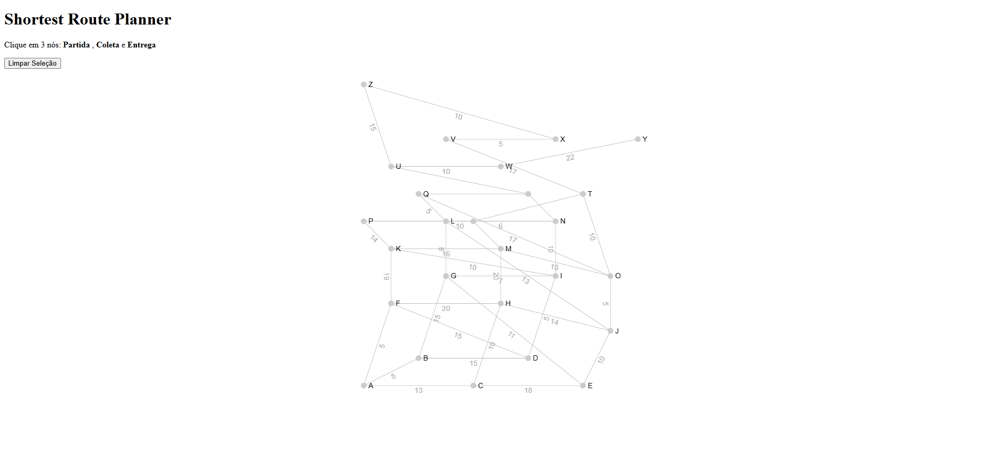
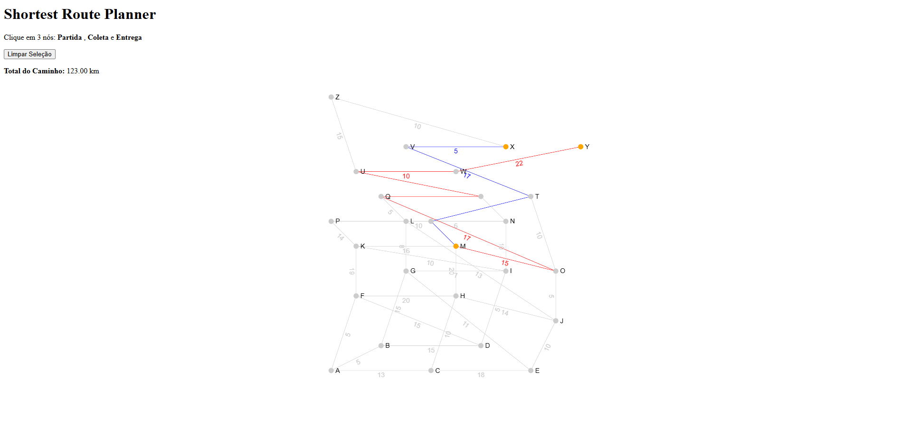

# Grafos2_Shortest_Route_Planner

**Número da Lista**: X<br>
**Conteúdo da Disciplina**: Projeto de Algoritmos<br>

## Alunos
|Matrícula | Aluno |
| -- | -- |
| 22/1007958  |  Cláudio Henrique dos Santos Carvalho |
| 22/1007706  |  Elias Faria de Oliveira |

## Sobre
O Shortest Route Planner é uma aplicação simples que implementa o algoritmo de dyjkstra em um grafo já pré-definido e apresenta uma simulação de como seria a rota de uma caminhão de entrega que parte de um nó, passa pelo o segundo que é o ponto de coleta e por ultimo chega ao nó final que é o da entrega. A aplicação disponibiliza ao usuário selecionar os três nós desejados e retorna a rota mais eficiente para realizar a rota com os nós selecionados, as arestas percorridas do nó de partida para o de coleta são destacadas em azul e as arestas do nó de coleta para o final de entrega, são destacadas em vermelho.

## Screenshots

Screenshot da tela Home do projeto:

1. Tela Inicial:



2. Cálculo da rota partindo de X, coletando em Y e entregando em M:



## Vídeo de apresentação e explicação do sistema TaskList

[Link da Gravação]()

## Instalação 
**Linguagem**: Typescript 5.8.3<br>
**Framework**: React 19.1.0<br>

1. Baixe o Node.js :
```
winget install Schniz.fnm
```

2. instalar a Node.js:
```
fnm install 22
```

3. Consultar a versão da Node.js(opcional):
```
node -v 
```

4. Consultar a versão da npm(opcional):
```
npm -v
```

5. Após instalar e verificar a versão, clone o repositório em sua máquina e vá até o diretório da aplicação com o comando:
```
cd shortest_route_planner
```

6. Instale as dependências:
```
npm i
```

7. Execute a aplicação localmente:
```
npm run dev
```

8. Vá até o endereço em seu navegador:
```
http://localhost:5173/
```

## Uso 

Basta abrir o endereço ```http://localhost:5173/``` no navegador e você deverá visualizar o grafo já definido. Agora selecione três nós de sua escolha do grafo e veja o caminho mais eficiente e econômico passando pelos três nós respectivamente.

## Outros 
Quaisquer outras informações sobre seu projeto podem ser descritas abaixo.